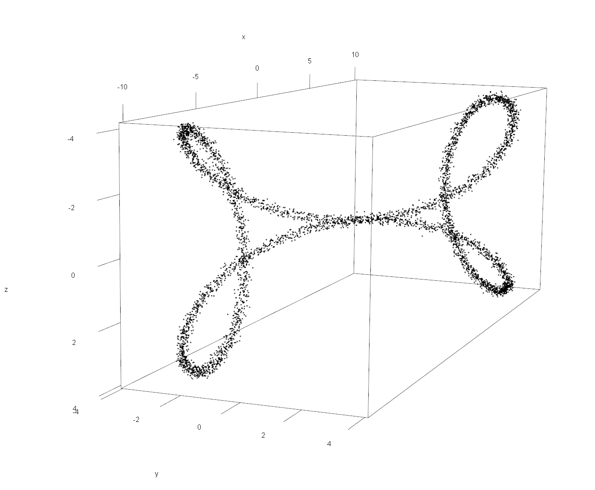

```{r setup, include=FALSE}
knitr::opts_chunk$set(echo = FALSE)
require(webtex)
devtools::load_all()
```

This is an implementation of the [mapper](https://research.math.osu.edu/tgda/mapperPBG.pdf) algorithm by Singh, Mémoli, and Carlsson, and also the [ballmapper](https://arxiv.org/pdf/1901.07410.pdf) algorithm from Dlotko.

## Setup

To install the latest version of this package from Github, run the following commands:

`install.packages("devtools")`

`library(devtools)`

`devtools::install_github("Uiowa-Applied-Topology/mappeR", upgrade=FALSE)`

`library("mappeR")`

If you're installing from Github, you might need to do some more stuff:

- **Windows:** install Rtools (http://cran.r-project.org/bin/windows/Rtools/)
- **OS X:** install Xcode (from the Mac App Store)
- **Linux:** run `apt-get install r-base-dev` (or similar).

## Mathy Overview

Mapper is a way to view a point cloud $P$ through a "lens" of our choice.

Consider a function
```math
f: P \to \mathbb{R}
```
Cover $\mathbb{R}$ in a set of intervals $\{I_i\}_{i=1}^n$, so that every point in $P$ is contained in some level set $L_i = f^{-1}(I_i)$. We may then construct a graph
```math
G = (V,E)
```
based on this cover to reflect the original data, where
```math
V = \{L_i \mid L_i \neq \varnothing\}
```
and
```math
E = \{\{L_i, L_j\}\mid L_i\cap L_j \neq \varnothing,\ i\neq j\}
```

This is the basic idea of the mapper algorithm, with the addition that each level set is first refined into clusters based on the intrinsic pairwise distances of the data according to some clustering algorithm. That is, we partition each level set $L_i$ into $k_i$ disjoint clusters
```math
L_i = \bigsqcup_{j=1}^{k_i} C_j
```
and build a new graph $G' = (V', E')$ that is homomorphic to $G$ defined by
```math
V' = \bigsqcup_{i=1}^{n}\{C_j\}_{j=1}^{k_i}
```
and
```math
E' = \{\{C_i, C_j\}\mid C_i\cap C_j \neq \varnothing\}
```

So in general, the ingredients to construct a mapper graph are

* A data set, along with their pairwise distances
* A *lens* function with the data as its domain (above this was real-valued, but it does not have to be)
* A cover of the codomain of the lens function
* A clustering algorithm

## Example: 1D Mapper

```{r data, echo=TRUE}
num_points = 5000

P.data = data.frame(
  x = sapply(1:num_points, function(x)
    sin(x) * 10) + rnorm(num_points, 0, 0.1),
  y = sapply(1:num_points, function(x)
    cos(x) ^ 2 * sin(x) * 10) + rnorm(num_points, 0, 0.1),
  z = sapply(1:num_points, function(x)
    10 * sin(x) ^ 2 * cos(x)) + rnorm(num_points, 0, 0.1)
)

P.dist = dist(P.data)
```

Here is a point cloud $P$ formed by adding a bit of uniform noise to 5000 points regularly sampled from the parametric curve

```math
\gamma(t) = \begin{cases}x = 10\sin(x)\\ y=10\sin(x)\cos^2(x)\\ z=10\sin^2(x)\cos(x) \end{cases}
```


This seems to form a kind of figure-8 curve just based on this projection. But as we can see from the 2D projections, the "shape" of the data set we're seeing really does depend on how we're looking at it:

```{r plotting the curve, fig.align='center'}
plot(P.data, pch = 20, asp = 1)
```
We will build graphs using the outline of the mapper algorithm described, with real-valued lens functions. The parameters used to generate the graphs below were:

* Data: figure-8
* Lens: Projection to each factor, or eccentricity (a measure of centrality per data point)
* Cover: A cover of $\mathbb{R}$ (really, just up to the extremes of the function values) using 10 equally spaced intervals with 25\% overlap between each consecutive interval
* Clustering method: Single-linkage hierarchical clustering

```{r mapper parameters, echo=TRUE}
# lens functions
projx = P.data$x
projy = P.data$y
projz = P.data$z
eccentricity = apply(as.matrix(P.dist), 1, sum) / num_points

# cover parameters to generate a width-balanced cover
num_bins = 10
percent_overlap = 25

xmapper = get_1D_mapper_data(P.data, projx, P.dist, num_bins, percent_overlap, "single")
ymapper = get_1D_mapper_data(P.data, projy, P.dist, num_bins, percent_overlap, "single")
zmapper = get_1D_mapper_data(P.data, projz, P.dist, num_bins, percent_overlap, "single")
eccentricmapper = get_1D_mapper_data(P.data, eccentricity, P.dist, num_bins, percent_overlap, "single")
```

The vertices in each output graph below are colored according to the level set the cluster belongs to, and scaled by (the square root of) the number of data points in the cluster.

```{r mapping the mapper, fig.show="hold", out.width="50%"}
colfunc <- colorRampPalette(c("blue", "gold", "red"))
bin_colors = colfunc(num_bins)

coverx = create_width_balanced_cover(min(projx), max(projx), num_bins, percent_overlap)
covery = create_width_balanced_cover(min(projy), max(projy), num_bins, percent_overlap)
coverz = create_width_balanced_cover(min(projz), max(projz), num_bins, percent_overlap)
eccentricitycover = create_width_balanced_cover(min(eccentricity),
                                                max(eccentricity),
                                                num_bins,
                                                percent_overlap)

imappergraphx = imapper(xmapper)
plot(imappergraphx, xlim = c(0, 2))
legend(
  "right",
  title = "x-coordinate",
  apply(coverx, 1, function(x)
    paste("[", round(x[1], 3), ", ", round(x[2], 3), "]")),
  fill = bin_colors,
  horiz = FALSE
)

imappergraphy = imapper(ymapper)
plot(imappergraphy, xlim = c(0, 2))
legend(
  "right",
  title = "y-coordinate",
  apply(covery, 1, function(x)
    paste("[", round(x[1], 3), ", ", round(x[2], 3), "]")),
  fill = bin_colors,
  horiz = FALSE
)

imappergraphz = imapper(zmapper)
plot(imappergraphz, xlim = c(0, 2))
legend(
  "right",
  title = "z-coordinate",
  apply(coverz, 1, function(x)
    paste("[", round(x[1], 3), ", ", round(x[2], 3), "]")),
  fill = bin_colors,
  horiz = FALSE
)

iecc = imapper(eccentricmapper)
plot(iecc, xlim = c(0, 2))
legend(
  "right",
  title = "eccentricity",
  apply(eccentricitycover, 1, function(x)
    paste("[", round(x[1], 3), ", ", round(x[2], 3), "]")),
  fill = bin_colors,
  horiz = FALSE
)
```

## Example: ballmapper

By toying with the general mapper parameters, we can obtain different flavors of the algorithm. In the *ballmapper* flavor, we simply use the inclusion into the ambient space of the data as our lens function, and let the cover do the work. Specifically, we cover the ambient space with $\varepsilon$-balls by creating a $\varepsilon$-net, which can be done with a greedy algorithm.

Parameters:

* Data: figure-8
* Cover: set of $\varepsilon$-balls in $\mathbb{R^3}$
* Lens function: inclusion from $P\hookrightarrow\mathbb{R}^3$
* Clustering method: none (or, "any data set is one big cluster"-type clustering)

There's a secret parameter here, which is $\varepsilon$. Below are output graphs for varying values of $\varepsilon$; the sizing is as with the 1D mapper, but no coloring is done as each vertex would have to receive its own color in this flavor, which is redundant.

```{r ballmapper parameters, echo=TRUE}
ballmapper1 = get_ballmapper_data(P.data, P.dist, .25)
ballmapper2 = get_ballmapper_data(P.data, P.dist, .5)
ballmapper3 = get_ballmapper_data(P.data, P.dist, 1)
ballmapper4 = get_ballmapper_data(P.data, P.dist, 2)
```

```{r ballmapper time, fig.show='hold', out.width="50%"}
library(latex2exp)

plot(imapper(ballmapper1), main = TeX(r"($\epsilon=.25$)"))
plot(imapper(ballmapper2), main = TeX(r"($\epsilon=.5$)"))
plot(imapper(ballmapper3), main = TeX(r"($\epsilon=1$)"))
plot(imapper(ballmapper4), main = TeX(r"($\epsilon=2$)"))
```
