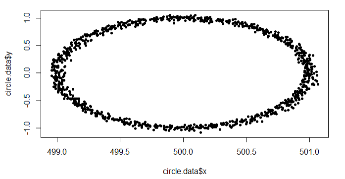
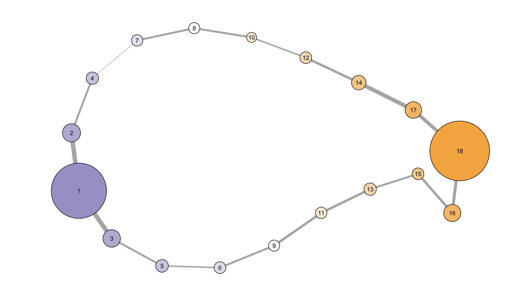

This is an implementation of the [mapper](https://research.math.osu.edu/tgda/mapperPBG.pdf) algorithm by Singh, Mémoli, and Carlsson.

To run the examples, first clone the repo. Open it in RStudio. `renv` should automatically take care of all the package stuff and prompt you along. You can also run `renv::restore()` in the R console.

Make sure Cytoscape is open, then you can run the examples in the R Markdown file.

Basic examples:

Noisy circle data, 10 bins, 15% overlap, single linkage clustering:  

Noisy clover data, 5 bins, 15% overlap, single linkage clustering:  
